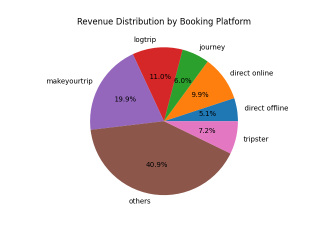

# 🏨 Hospitality Data Analysis (EDA Project)


---

## 🚀 Project Summary
This project performs end-to-end Exploratory Data Analysis (EDA) on a hospitality dataset to uncover actionable insights related to revenue, occupancy, and booking behavior.  

It simulates real-world business decision-making by transforming raw data into meaningful, data-driven strategies.

---

## 🧠 Business Problem
AtliQ Grands, a multi-city hotel chain in India, is facing challenges in revenue optimization and occupancy management due to increasing competition and underutilization of data.  

This project focuses on analyzing booking data to identify key trends and provide actionable insights to improve business performance.

---

## 🎯 Objectives
- Analyze revenue trends across cities and hotel categories  
- Understand occupancy patterns and demand fluctuations  
- Evaluate booking platform performance  
- Detect and handle data quality issues  
- Generate actionable business insights for decision-making  

---

## 🔄 Data Workflow
Raw Data → Data Cleaning → Transformation → Analysis → Insights → Business Recommendations  

---

## 🧹 Data Cleaning
- Removed invalid records (e.g., negative or zero guests)  
- Handled missing values for better data consistency  
- Detected and removed outliers using statistical techniques (Standard Deviation method)  

👉 Ensured high data quality for reliable analysis.

---

## ⚙️ Feature Engineering
- Created a key KPI: **Occupancy Rate (%)**  
- Merged multiple datasets (fact + dimension tables)  
- Transformed data into analysis-ready format  

👉 Enabled performance comparison across cities and hotel categories.

---

## 📊 Key Analysis Performed
- Revenue analysis by hotel category  
- Average customer ratings across cities  
- Booking platform contribution to revenue  
- Occupancy trends (weekday vs weekend)  
- Monthly performance trends  

---

## ❓ Business Questions Solved
- Which hotel category generates the highest revenue?  
- Which city has the best occupancy performance?  
- How does weekday vs weekend demand vary?  
- Which booking platform contributes the most revenue?  
- What are the trends in customer ratings?  

---

## 📈 Key Insights
- Weekend occupancy is significantly higher than weekdays → clear demand pattern  
- Luxury hotel categories generate the highest revenue → strong premium segment  
- Certain cities outperform others in both revenue and occupancy → key markets identified  
- Booking platforms play a major role in revenue distribution → high dependency on aggregators  

---

## 🛠️ Tech Stack
- Python (Pandas, NumPy)  
- Matplotlib (Visualization)  
- SQL concepts (for data understanding)  

---

## 📂 Project Structure

## 📂 Project Structure

```bash
src/
├── data_extraction.py
├── data_cleaning.py
├── data_transformation.py
├── data_insights.py

requirements.txt
README.md
```
## 📈 Data Insights & Visualizations

### 📊 Revenue Distribution by Booking Platform



### 🔍 Key Insights:
- Majority revenue (~40%) comes from aggregated **"others"** category  
- **MakeMyTrip (~20%)** is the strongest individual booking platform  
- Direct channels (**online + offline**) contribute less revenue  
- Indicates high dependency on third-party booking platforms  
## 🎥 Project Walkthrough
👉 [](https://youtu.be/1922byylCSU)
---

## ⚠️ Note
Dataset is not included due to best practices and data privacy.

---

## 💡 Conclusion
This project demonstrates a complete data analysis pipeline, from raw data handling to business insight generation. It reflects real-world analytical thinking and problem-solving skills required for data analyst roles.


## 👤 Author

**Shubhayan Kundu**  
📊 Data Analyst | Python | SQL | Power BI | Excel

🔗 LinkedIn: [https://www.linkedin.com/in/YOUR-LINKEDIN-ID](https://www.linkedin.com/in/subhayan-kundu/)
